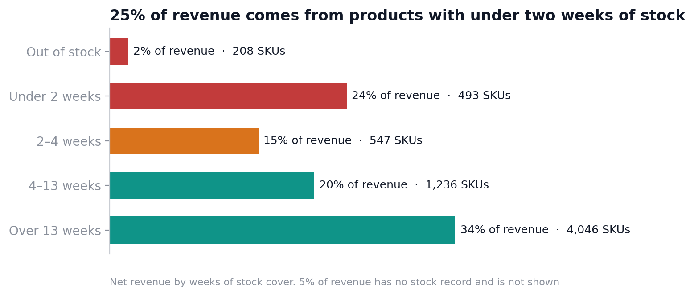
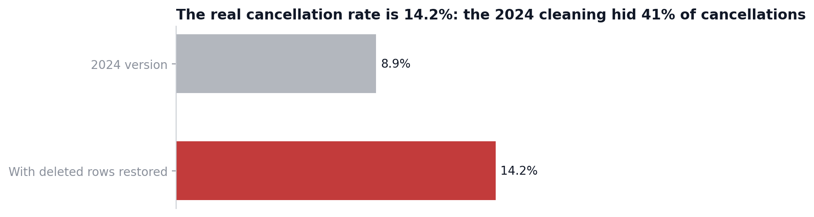
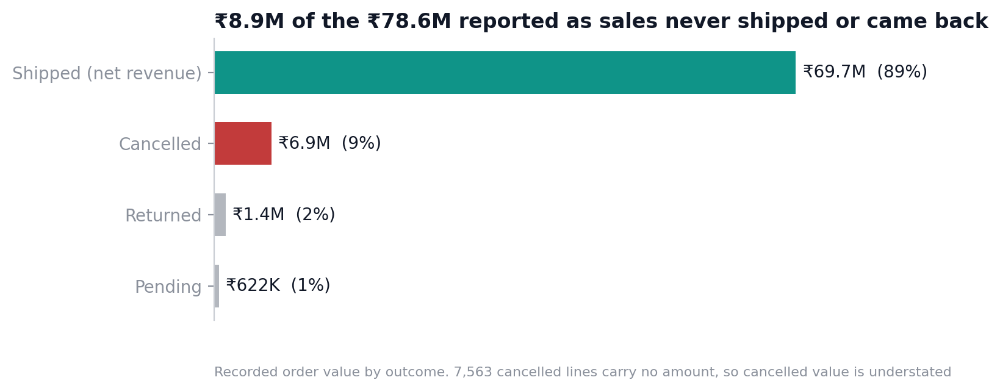
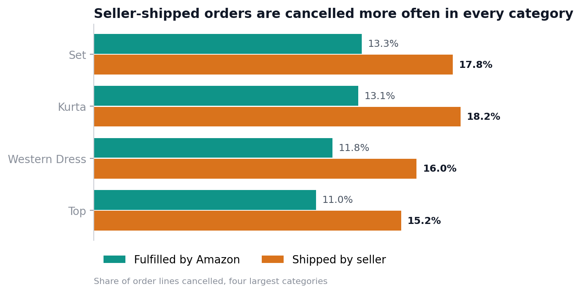
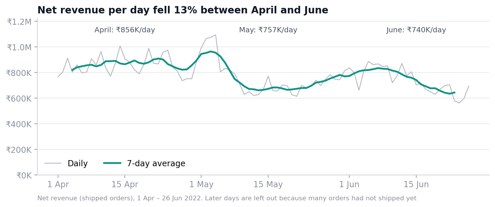
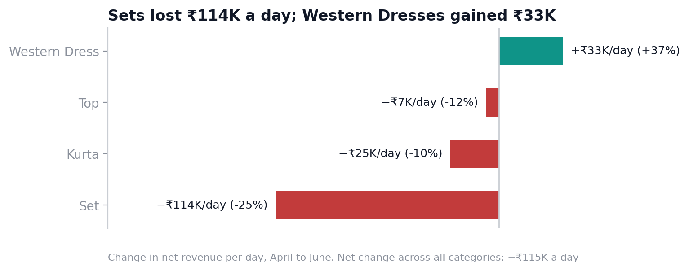
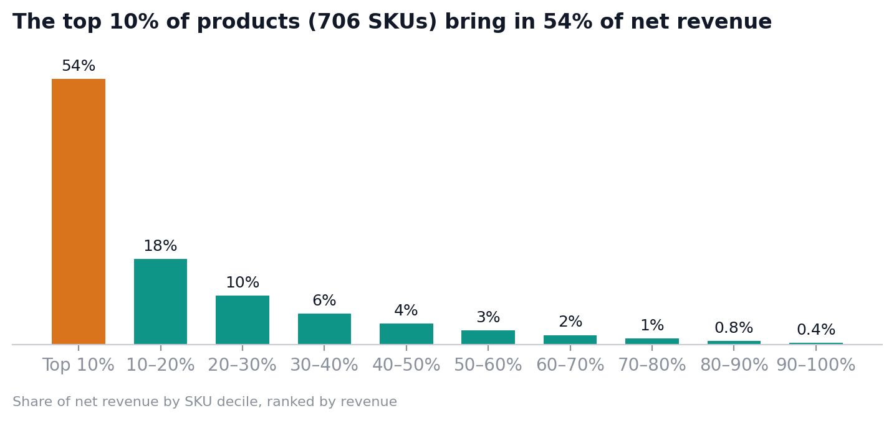
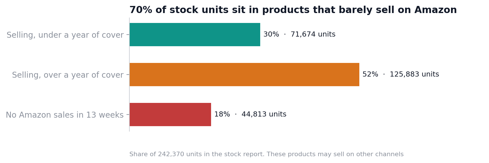

# Amazon.in Apparel Seller: Operations & Stock Review

**Tools:** Python (pandas) · SQL (SQLite) · Power BI
**Data:** one Indian clothing seller's Amazon.in order report, 128,975 order lines, 31 Mar – 29 Jun 2022, joined to the seller's stock report (9,170 SKUs). Source: [E-Commerce Sales Dataset on Kaggle](https://www.kaggle.com/datasets/thedevastator/unlock-profits-with-e-commerce-sales-data)

**Purpose:** give the seller's operations team three answers. Should we ship orders ourselves or let Amazon do it? Is our stock in the right products? Why is revenue falling?



**The difference this analysis made**

I first analysed this dataset in 2024. Rebuilding it from the raw files changed the picture:

| Question | 2024 version | This version |
|---|---|---|
| What is the cancellation rate? | 8.9% | **14.2%.** The 2024 cleaning deleted 7,795 rows with no amount; 7,566 of them were cancelled orders, 41% of all cancellations |
| How much was sold? | ₹78.6M | **₹69.7M net.** The old total counted ₹6.9M of cancelled orders, plus returned and pending ones |
| Where is the seller selling? | "Around the world", with a world map | **India only.** Every order ships within India, on Amazon.in |
| Which states matter? | 69 spellings ("Rajasthan", "Rajsthan", "RJ") | **36 states and territories**, each counted once |
| Is stock in the right place? | Not analysed | **25% of revenue sits on under two weeks of stock, while 70% of stock units barely sell on Amazon** |
| What does the model show? | A classifier predicting order status from the order amount | Removed. Replaced by tests that answer a business question |

**What this project demonstrates**

| Skill | Where to see it |
|---|---|
| **Data quality auditing.** Restored wrongly deleted rows, found a recording artifact that would have produced a false conclusion, and logged every issue | [Section 1](#1-data-quality-audit) · [`python/01_clean.py`](python/01_clean.py) · [cleaning log](data/clean/data_quality_log.csv) |
| **Joining datasets.** Sales joined to a separate stock report by SKU (94% match), with the unmatched share reported | [`sql/05_stock_cover.sql`](sql/05_stock_cover.sql) |
| **SQL analysis.** CTEs, window functions (`ntile`), conditional aggregation, scenario estimates | [`sql/`](sql/) · results in [`outputs/`](outputs/) |
| **Statistics.** Two-proportion z-test with a confidence interval | [`notebooks/analysis.ipynb`](notebooks/analysis.ipynb) |
| **Business communication.** Findings, recommendations with estimates, and stated limitations | [Recommendations](#7-recommendations) |

---

## Executive summary

- **Seller-shipped orders are cancelled more often than Amazon-fulfilled ones: 17.5% vs 12.8%.** The gap holds in every major category and is statistically significant (p < 0.001).
- **Stock is thin where it sells and deep where it doesn't.** A quarter of revenue comes from products with under two weeks of stock. Meanwhile 70% of stock units sit in products with over a year of cover or no Amazon sales at all.
- **Revenue per day fell 13% from April to June.** It's a demand problem: 18% fewer units a day at slightly higher prices. Sets lost ₹114K a day; Western Dresses gained ₹33K.
- **The top 10% of products (710 SKUs) bring in 54% of revenue**, and 247 of them are out of stock or nearly out.
- **About ₹12M of orders were cancelled** in 13 weeks, roughly 14% of what customers tried to buy.

---

## 1. Data quality audit
*(`python/01_clean.py` · full log in [`data/clean/data_quality_log.csv`](data/clean/data_quality_log.csv))*

| # | Issue | Rows | How I handled it |
|---|---|---|---|
| 1 | **The 2024 cleaning deleted rows with no amount** | 7,795 | Restored. 7,566 are cancelled orders, so deleting them hid 41% of cancellations |
| 2 | **Promotion codes are only recorded on orders that shipped** | 49,150 without a code | Only 295 of 18,329 cancelled orders carry a code. "Promotions prevent cancellations" would be a false reading, so the field is not used to explain cancellations |
| 3 | **State names spelled inconsistently** | 69 spellings | Merged into 36 states and territories |
| 4 | **Cancelled orders carry an amount** | 10,766 | Excluded from net revenue. Net revenue = shipped orders only |
| 5 | **Returns only appear for seller-shipped orders** | 0 Amazon-fulfilled returns | Amazon handles those returns and they are absent from this report, so return rates are shown for seller-shipped orders only |
| 6 | **The last days look weak because orders hadn't shipped yet** | 3,150 | On 28 June, 32% of orders were still pending. Trends end on 26 June |
| 7 | **13 raw order statuses** | all | Grouped into 5 outcomes: Shipped, Cancelled, Returned, Pending, Lost or damaged |
| 8 | **Exact duplicate order lines** | 6 | Removed |
| 9 | **Stock report: duplicate and blank SKUs** | 106 | Blanks removed; duplicates summed |
| 10 | **The Kaggle price lists share no SKUs with these orders** | 0% match | Not used. They describe a different product range, so profit margins cannot be computed |

**Missing values:** no order was deleted. Lines with no amount stay in the counts and are flagged; missing states are labelled "Unknown"; SKUs with no stock record (6% of order lines) are left out of the stock analysis only.



## 2. Where ordered value ends up
*(`sql/02_revenue_and_outcomes.sql`)*



| Outcome | Order lines | Share | Recorded value |
|---|---|---|---|
| Shipped | 107,578 | 83.4% | **₹69.7M** |
| Cancelled | 18,329 | 14.2% | ₹6.9M recorded, about ₹12.0M estimated* |
| Returned | 2,109 | 1.6% | ₹1.4M |
| Pending | 947 | 0.7% | ₹0.6M |

*7,563 cancelled lines have no amount. Pricing them at the average shipped value for their category adds about ₹5.0M.

## 3. Ship it yourself, or let Amazon do it?
*(`sql/03_fulfilment.sql`)*



| | Fulfilled by Amazon | Shipped by seller |
|---|---|---|
| Share of order lines | 69.5% | 30.5% |
| **Cancellation rate** | **12.8%** | **17.5%** |
| Return rate (of shipped) | not recorded | 6.6% |
| Net revenue per shipped line | ₹647 | ₹649 |

- The gap is **4.7 percentage points** (95% CI 4.2 to 5.1; z = 22.2; p < 0.001).
- It holds **within every major category**, so it isn't explained by which products are sent to Amazon's warehouses.
- Order value is the same either way, so the difference is in fulfilment, not in what's being sold.
- **If seller-shipped orders cancelled at Amazon's rate, about 1,840 more orders would ship each quarter, worth roughly ₹1.2M.**

## 4. Revenue is falling, and it's a demand problem
*(`sql/02_revenue_and_outcomes.sql`)*



| Month | Net revenue per day | Units per day | Revenue per unit |
|---|---|---|---|
| April | ₹856K | 1,373 | ₹623 |
| May | ₹757K | 1,146 | ₹660 |
| June (to the 26th) | ₹740K | 1,126 | ₹657 |

Units per day fell 18% while revenue per unit rose 5%, so customers are buying fewer items, not cheaper ones.



- **Sets** fell from ₹460K to ₹347K a day (−25%). **Western Dresses** grew from ₹88K to ₹120K (+37%).
- The fall is broad: products with adequate stock still sold about 20% fewer units a day. But **Sets on thin stock (under two weeks of cover) fell 41%, twice as fast** as well-stocked Sets. Thin stock made a demand dip worse in the biggest category.

## 5. A small share of products carries the business
*(`sql/04_products.sql`)*



- The **top 10% of SKUs (about 710) bring in 54%** of net revenue. The bottom half brings in 7%.
- **Sets (50%) and Kurtas (27%)** make up 77% of revenue.
- Five states (Maharashtra, Karnataka, Telangana, Uttar Pradesh, Tamil Nadu) account for 56% of revenue.

## 6. Stock: thin where it sells, deep where it doesn't
*(`sql/05_stock_cover.sql`)*

Weeks of cover = stock on hand ÷ average units shipped per week over the 13 weeks.

| Stock cover | SKUs | Share of revenue |
|---|---|---|
| Out of stock | 208 | 2% |
| **Under 2 weeks** | **493** | **24%** |
| 2–4 weeks | 547 | 15% |
| 4–13 weeks | 1,236 | 20% |
| Over 13 weeks | 4,046 | 34% |

- **Of the 710 best-selling SKUs, 11 are out of stock and 236 have under two weeks of cover.** Together they earned ₹13.6M in the quarter, 20% of revenue.
- The best-selling style, a Western Dress (JNE3797, ₹2.5M), is **out of stock in size XXL**.



- **52% of stock units** (125,883) are in products with more than a year of cover at the current Amazon sales rate.
- **18% of stock units** (44,813, across 2,315 SKUs) are in products with no Amazon sales in 13 weeks.

## 7. Recommendations

| # | Recommendation | Evidence | Estimated impact |
|---|---|---|---|
| 1 | **Reorder the 247 best-sellers that are out of stock or under two weeks of cover**, starting with the top Western Dress styles | They earned ₹13.6M in 13 weeks | Protects about 20% of revenue |
| 2 | **Move more seller-shipped volume to Amazon fulfilment**, or fix the seller's own dispatch process | 17.5% vs 12.8% cancelled, in every category | About 1,840 more shipped orders, roughly ₹1.2M a quarter |
| 3 | **Clear slow stock.** Mark down, bundle or move to other channels the products with over a year of cover or no sales | 70% of stock units | Frees working capital for best-sellers |
| 4 | **Put growth behind Western Dresses** and review the Sets range | +37% vs −25% in revenue per day | Rebalances a business that is 50% Sets |
| 5 | **Fix the reporting.** Report net revenue, record promotions when the order is placed, capture returns for Amazon-fulfilled orders, and use standard state names | Sections 1 and 2 | Makes cancellations, promotions and returns measurable |

## 8. Limitations

- **Thirteen weeks from one seller.** There's no year-on-year comparison, so the April–June fall may be partly seasonal.
- **The stock report has no date.** I treated it as stock at the end of the period; cover figures are indicative.
- **Stock may sell on other channels.** "Not selling on Amazon" doesn't prove the stock is dead.
- **No cost data.** The Kaggle price lists don't match these SKUs, so the analysis covers revenue, not profit.
- **The data doesn't say who cancelled.** A cancellation could be the buyer's choice or the seller running out of stock.
- **The fulfilment gap is an association.** It holds within categories, but products weren't randomly assigned to a fulfilment method.

## 9. Power BI dashboard

*In progress.* The star-schema tables are produced by [`sql/07_powerbi_exports.sql`](sql/07_powerbi_exports.sql): `fact_orders`, `dim_product` (with stock and weeks of cover), and `dim_state`.

## How to run

```bash
python3 -m venv .venv && .venv/bin/pip install -r requirements.txt
./run_all.sh
```

This cleans the raw files, loads them into SQLite, runs every SQL analysis (results in `outputs/`), exports the Power BI tables and redraws the charts.

## Project structure

```
├── data/
│   ├── raw/                         original order report (compressed) and stock report
│   └── clean/data_quality_log.csv   every issue found and how it was handled
├── python/
│   ├── 01_clean.py                  cleaning: restored rows, outcomes, states, stock
│   └── build_notebook.py            source for the analysis notebook
├── sql/                             load + 5 analysis scripts + Power BI exports
├── notebooks/analysis.ipynb         charts and the significance test
├── outputs/                         SQL results (.txt) and charts (charts/*.png)
├── archive_2024/                    my original 2024 notebook, dashboard and cleaned file
├── requirements.txt
└── run_all.sh
```
